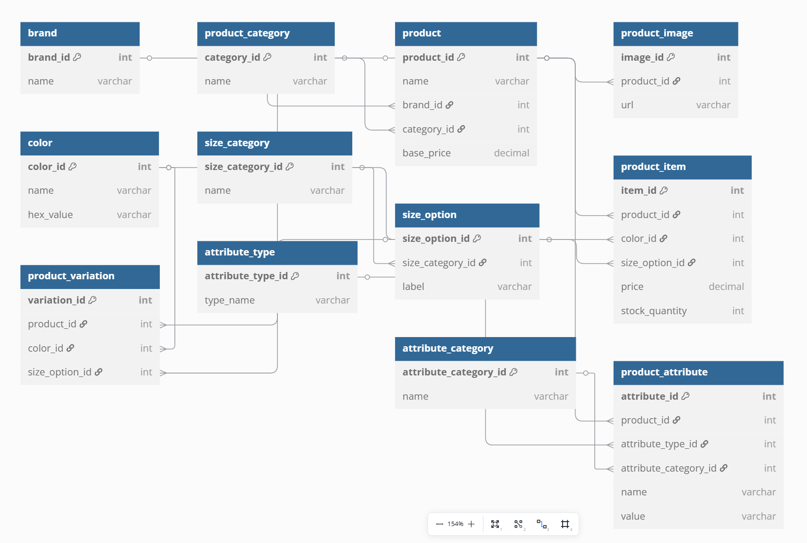

# 🛒 E-commerce Database Design

## 📘 Overview

This repository contains the complete design and implementation of a relational database schema for an e-commerce platform. It is a collaborative assignment aimed at mastering the art of database modeling and SQL schema development.

---

## 📂 Files Included

- `ecommerce.dbml` — Visual representation of the database schema for use with [dbdiagram.io](https://dbdiagram.io/).
- `ecommerce.sql` — SQL schema file containing `CREATE TABLE` statements to build the database.
- `ecommerce-er-diagram.png` — Screenshot of the ERD diagram showing all entities and their relationships.
- `README.md` — This documentation file.

---

## 🎯 Objective

Design and implement a normalized, relational database schema for an e-commerce application. The database supports product catalogs, attributes, inventory management, and variations.

---

## 🗃️ Tables Overview

| Table Name           | Description |
|----------------------|-------------|
| `brand`              | Stores brand-related information |
| `product_category`   | Classifies products into categories |
| `product`            | Stores core product data including name, brand, category, and base price |
| `product_image`      | Stores URLs of product images |
| `color`              | Defines color options for product variations |
| `size_category`      | Groups size options (e.g., clothing vs shoes) |
| `size_option`        | Individual size options like 'S', 'M', 'L', or '42' |
| `product_item`       | Defines a purchasable instance of a product (color + size) with price and stock |
| `product_variation`  | Links a product to its possible variations (e.g., color or size) |
| `attribute_type`     | Describes the type of attribute (text, boolean, number) |
| `attribute_category` | Groups attributes by category (technical, physical) |
| `product_attribute`  | Stores specific product attributes like material, weight, etc. |

---

## 🔄 Data Flow & Relationships

- Products are classified by **brands** and **categories**.
- Each **product** can have multiple **images**, **items**, and **attributes**.
- **Product items** are unique combinations of **color** and **size option**.
- **Size options** are grouped under **size categories** (e.g., clothing vs shoes).
- **Product variations** allow optional color/size combinations (e.g., T-shirt available in red, blue, and M, L sizes).
- **Attributes** provide descriptive metadata for products.

---

## 🏗️ How to Use

1. Clone this repository:
```bash
git clone https://github.com/Bum-Ho12/DB_design_group_work.git
cd DB_design_group_work
```

2. Open `ecommerce.dbml` with [dbdiagram.io](https://dbdiagram.io/) for visual schema inspection.

3. Execute the SQL script in your preferred SQL environment:
```sql
-- MySQL / PostgreSQL / SQLite
SOURCE ecommerce.sql;
```

---

## 🤝 Group Collaboration Tips

- Use GitHub for version control and progress tracking.
- Keep meetings regular and collaborative.
- Ensure every member understands each table and relationship.

---

## 📸 ER Diagram



---

## 👨‍💻 Contributors

- Sharon Nyamongo - Database Design & SQL
- [Your Name 2] - ERD & Documentation
- [Your Name 3] - dbdiagram.io Modeling

---

## 🧠 License

This project is for educational use. Please feel free to fork and adapt.

---

## 🧾 Submission Checklist

- ✅ ERD diagram (`.dbml` and `.png`)
- ✅ SQL schema (`ecommerce.sql`)
- ✅ README documentation (`README.md`)